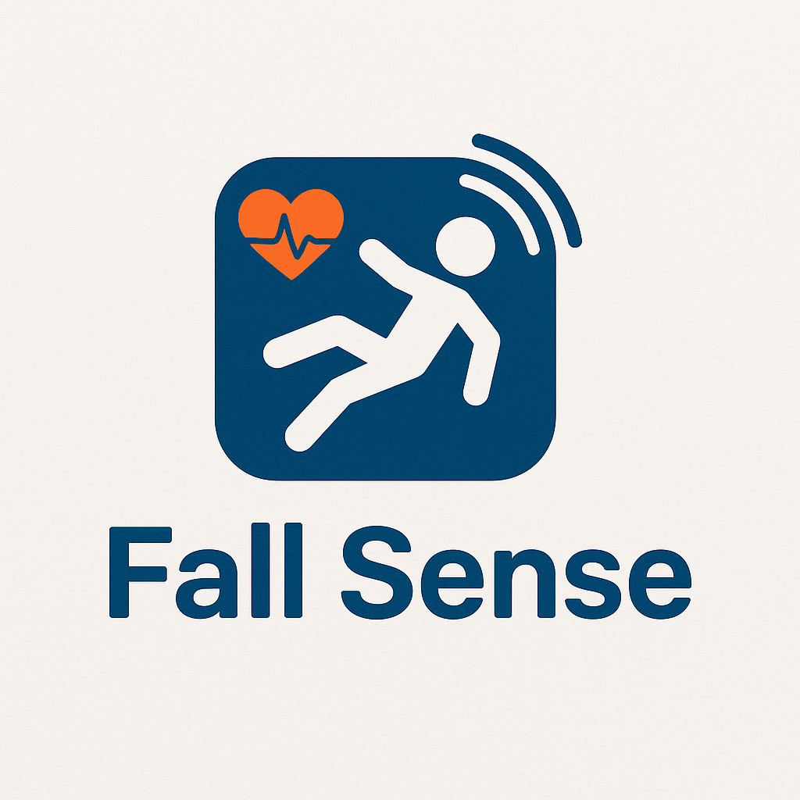

# FallSense

A open-source AI application with sleek UI with fine-tuned model using PyTorch based YOLOv7 application for stroke detection and monitoring old patients and targets at risk.

# Features

## Real Time Stroke Detection

- This feature is powered state-of-the-art model: YOLOv7 built with the Pytorch library. The original model from [WongKinYiu](https://github.com/WongKinYiu/yolov7) is fined-tuned with more CCTV footages of sudden stroke with Colab for better detection capabilities.

## Stroke Detection Analysis

- This feature allows the user to load stroke recorded moments for the system to analyze and train upon.

## Automatic Recorder

- This feature allows the user to automatically record the moment an imminent stroke is detected at home. The footage is stored locally and could be of great use for doctors for further analysis or to re-train the model.

# Instruction

## Step 1: Prepare Environment

- Install Miniconda
- Create new virtual environment: `conda create -n <env_name> python=3.11.10`
- To access the virtual environment: `conda activate <env_name>`

## Step 2: Clone this repo:

- `git clone https://github.com/ngotphong/fall-detection.git`
- Install all the dependencies in the requirments.txt: `pip install -r requirements.txt`

## Step 3: Install Libraries and Dependencies:

- `pip install -r requirements.txt`

## Step 4: Prepare Weight:

```
App_falling/
├── weights/
│ ├── fall_detection_person.pt
```

- Download and put this in the same position, make any changes if needed

## Step 5: Run The FallSense:

- `cd App_falling`
- `python Main_Gui.py`
