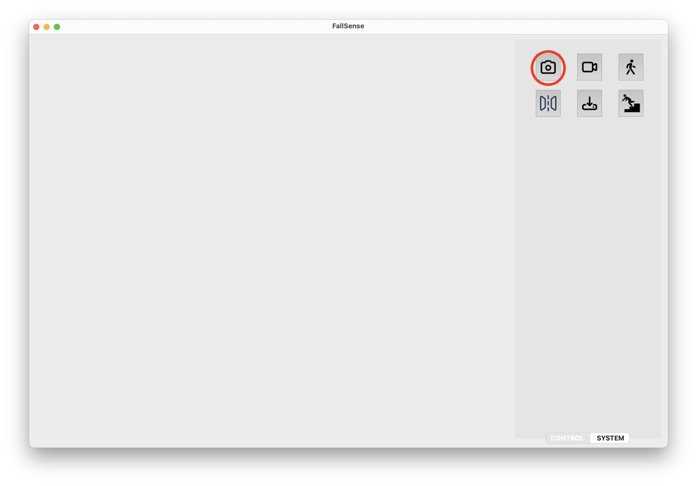

# FallSense

**FallSense** is an open-source AI application with a sleek UI, powered by a fine-tuned YOLOv7 model (PyTorch) for real-time stroke and fall detection. Designed for monitoring elderly patients and individuals at risk, FallSense provides instant alerts, automatic video recording, and actionable analytics to help caregivers and medical professionals respond quickly and effectively.

---

## 🚀 Features

### 1. Real-Time Stroke & Fall Detection

- Utilizes a state-of-the-art YOLOv7 model, fine-tuned on real CCTV footage for robust detection of sudden strokes and falls.
- Fast, accurate, and reliable—works with live camera feeds or video files.


Live Camera feature

### 2. Automatic Event Recorder

- Instantly records and saves video clips when a fall or stroke is detected.
- Footage is stored locally for later review, medical analysis, or model retraining.


Automatically records and saves the falling moment for future analysis (only work in live camera feature)

### 3. Detection Analysis & Review

- Load and analyze previously recorded events.
- Useful for both medical professionals and AI researchers.


Allows user-uploaded footages for further analysis

### 4. User-Friendly Interface

- Modern, intuitive PyQt5 GUI.
- Easy toggles for camera, video, and keypoint visualization.
- Customizable settings for recording, saving, and flipping video feeds.


Toggle keypoint (skeleton) display

Flip the camera (only in camera mode)

Setting the folder where footages will be stored

---

## 📸 Screenshots


---

## 🛠️ Installation & Setup

### 1. **Prepare Environment**

- Install [Miniconda](https://docs.conda.io/en/latest/miniconda.html)
- Create a new virtual environment:
  ```sh
  conda create -n fallsense python=3.11.10
  conda activate fallsense
  ```

### 2. **Clone the Repository**

```sh
git clone https://github.com/ngotphong/fall-detection.git
cd fall-detection
```

### 3. **Install Dependencies**

```sh
pip install -r requirements.txt
```

### 4. **Download Model Weights**

- Download the fine-tuned YOLOv7 weights from [Hugging Face](https://huggingface.co/ngotphong/FallSense/tree/main)
- Place the file in the `weights/` directory:
  ```
  weights/
    └── fall_detection_person.pt
  ```

### 5. **Run FallSense**

```sh
python Main_Gui.py
```

---

## 📂 Project Structure

```
FallSense/
├── GUI/
│   └── images/
│       └── logo.png
├── weights/
│   └── fall_detection_person.pt
├── Main_Gui.py
├── src/
│   └── ...
├── requirements.txt
└── README.md
```

---

**Tips:**

- Add your screenshots/GIFs in the "Screenshots" section.
- Update the Hugging Face/model links as needed.
- Add badges (build, license, etc.) at the top for extra polish.

Let me know if you want a more minimal or more technical version!

---

## 🤝 Contributing

Contributions are welcome!

- Please open issues for bug reports or feature requests.
- Pull requests are encouraged for improvements, new features, or documentation updates.

---

## 📄 License

This project is licensed under the MIT License. See [LICENSE](LICENSE) for details.

---

## 🙏 Acknowledgements

- [YOLOv7 by WongKinYiu](https://github.com/WongKinYiu/yolov7)
- [Hugging Face Model Hosting](https://huggingface.co/ngotphong/FallSense)
- PyTorch, OpenCV, PyQt5, and the open-source community

---

## 📬 Contact

For questions, support, or collaboration, please open an issue or contact [ngotphong](https://github.com/ngotphong).

---

<!-- Add more badges, images, or links as your project grows! -->
